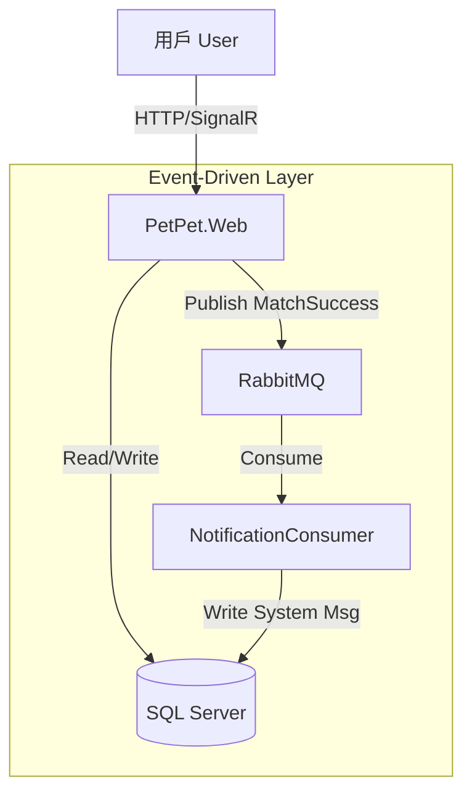

# PetPet.Modern (.NET 8 Event-Driven Architecture)

> 🚀 **Modernizing Legacy App**: 從傳統單體架構轉型為 **事件驅動模組化單體 (Event-Driven Modular Monolith)** 的示範專案。

## 🌟 專案亮點 (Key Features)

### 1. 現代化架構 (Modern Architecture)
*   **Backend:** .NET 8, Clean Architecture, Entity Framework Core.
*   **Event-Driven:** **RabbitMQ** + **MassTransit** 實現業務解耦 (Decoupling)。
*   **Database:** SQL Server 2022 (Dockerized).
*   **Frontend:** ASP.NET Core MVC + Vanilla JS + Tailwind Design (Card Swipe UI).

### 2. 核心功能 (Core Features)
*   **Tinder-style Matching:** 使用者左滑/右滑，雙向喜歡 (Double Opt-in) 才配對。
*   **Real-time Notification:** 配對成功後，透過 **Event Bus** 非同步觸發系統通知。
*   **Chat System:** 實作基本的聊天室功能，並整合 **AI 智能伴侶** (Auto-Reply)。
*   **Ziwei Matching:** 結合東方命理 **(紫微斗數)** 的趣味配對演算法。
*   **RBAC Security:** 區分 `Admin` (後台數據分析) 與 `User` (配對/發文) 權限。

### 3. 工程實踐 (Engineering Practices)
*   **Load Testing:** 內建 C# 壓測工具，驗證 100+ 併發用戶穩定性 (187 RPS)。
*   **Containerization:** 完整 Docker Compose 支援 (Web + DB + MQ)。
*   **Seeding:** 自動生成 100+ 模擬用戶與測試資料。

---

## 🛠️ 快速開始 (Quick Start)

### 前置需求 (Prerequisites)
*   Docker Desktop
*   .NET 8 SDK (Optional, for local dev)

### 一鍵啟動 (One-Click Start)
```powershell
cd PetPet.Modern
docker-compose up -d --build
```

### 預設帳號 (Default Accounts)
| 角色 | Email | Password | 備註 |
| :--- | :--- | :--- | :--- |
| **Admin** | `admin@petpet.com` | `admin` | 可存取後台Dashboard |
| **User** | `alice@test.com` | `password` | 一般會員 |
| **User** | `bob@test.com` | `password` | 一般會員 |
| **Spy** | `spy@test.com` | `password` | 測試權限隔離用 |

---

## 🏗️ 系統架構圖 (System Architecture)



## 📂 目錄結構 (Directory Structure)
*   `src/PetPet.Domain`: 實體 (Entities) 與事件 (Events)。
*   `src/PetPet.Infrastructure`: 資料庫 (EF Core), 服務實作 (Services), 消費者 (Consumers)。
*   `src/PetPet.Web`: 控制器 (Controllers), 視圖 (Views), 啟動配置 (Program.cs)。
*   `src/PetPet.LoadTest`: 壓力測試工具。

---
*Created by Antigravity Agent Swarm*
